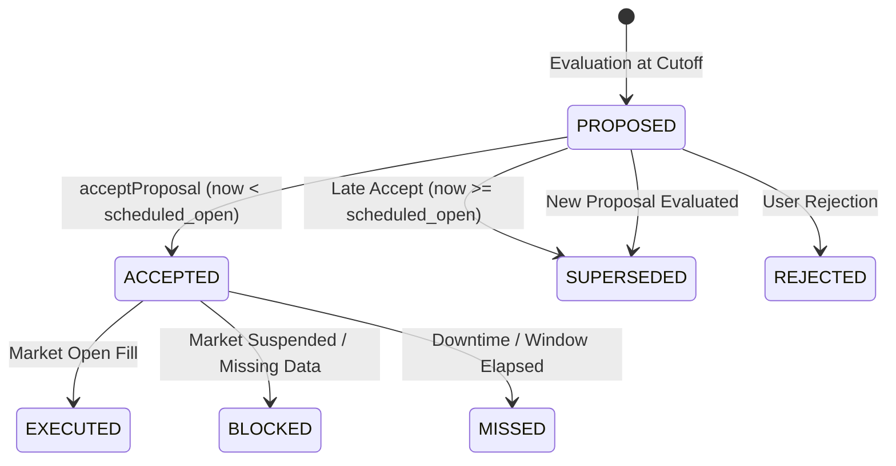

# SignalForge Milestone M5: Prospective Paper Tracking Architecture & Reference Guide

This document defines the architecture, relational database schema, lifecycle state machines, corporate actions handling, execution coordination, downtime recovery, and grounded AI assistant integration for Milestone M5 (Prospective Paper Tracking).

---

## 1. Core Architecture & Schema

Milestone M5 extends SignalForge with prospective paper portfolio tracking (`mode = 'PAPER'`) while strictly preserving the single ledger source of truth established in M1b (`portfolios`, `portfolio_state`, `positions`, `operations`, `transactions`). Paper portfolios operate exclusively in base currency `EUR`.

### 1.1 Relational Schema (Migration V12)

The prospective paper tracking engine introduces 9 dedicated relational tables in `V12__paper_tracking_and_proposals.sql`:

1. **`paper_portfolio_segments`**:
   - Stores tracking parameters: `dataset_id`, `strategy_id`, `strategy_version`, `universe_id`, `benchmark_listing_id`, `rebalance_cycle_id`, `mode_history_json`, `created_at`, `updated_at`.
   - Foreign keys to `portfolios(id)` and `datasets(id)`.

2. **`paper_proposals`**:
   - Immutable strategy proposals generated at evaluation cutoffs.
   - Key attributes: `id`, `portfolio_id`, `cycle_id`, `strategy_id`, `strategy_version`, `dataset_id`, `dataset_checksum`, `evaluation_session_date`, `input_cutoff_instant`, `evaluation_instant`, `scheduled_open_session_date`, `scheduled_open_instant`, `status` (`PROPOSED`, `ACCEPTED`, `REJECTED`, `SUPERSEDED`), `reason_code`, `portfolio_state_version`.
   - SQLite triggers enforce immutability once accepted or rejected.

3. **`paper_proposal_items`**:
   - Asset-level target allocations: `listing_id`, `rank`, `target_weight`, `prior_weight`, `score`, `reason_code`, `observation_kind`.

4. **`paper_proposal_observations`**:
   - Exact price and signal indicators used during proposal evaluation for complete auditability.

5. **`paper_execution_intents`**:
   - Represents scheduled market rebalances created upon proposal acceptance.
   - Status: `PENDING`, `FILLED`, `BLOCKED`, `MISSED`.

6. **`paper_intent_transitions`**:
   - Append-only state transition audit trail for execution intents (`from_status`, `to_status`, `trigger_type`, `transition_instant`, `notes`).

7. **`paper_execution_results`**:
   - Fills booked at scheduled market open: `requested_quantity`, `executed_quantity`, `raw_open_price`, `fill_price`, `commission`, `cost_basis`, `realized_gain`, `market_effective_instant`, `booked_instant`.

8. **`paper_receivables` & `paper_processed_corporate_actions`**:
   - Prospective cash distribution ledger for tracking pending dividends between `ex_date` and `payment_date`.
   - Idempotency tracking prevents duplicate corporate action application.

9. **`paper_valuations`**:
   - Periodic marks: `observation_kind` (`OPENING`, `SESSION_CLOSE`), `cash_balance`, `positions_market_value`, `receivables_value`, `total_equity`, `cumulative_return`, `drawdown`, `data_readiness_status`.

---

## 2. Proposal Lifecycle & State Machine



### 2.1 Acceptance & Concurrency Control
- **Temporal Enforcement**: A proposal can only be accepted *before* its `scheduled_open_instant`. If acceptance is attempted after the scheduled open, the proposal is marked `SUPERSEDED` and rejected with `409 Conflict`.
- **Optimistic Concurrency**: Acceptance uses a Compare-And-Swap (CAS) update:
  ```sql
  UPDATE paper_proposals 
  SET status = 'ACCEPTED', accepted_at = ? 
  WHERE id = ? AND status = 'PROPOSED'
  ```
  In high-concurrency environments, exactly 1 thread succeeds and remaining parallel callers receive `409 Conflict`.

---

## 3. Execution & Sizing Engine

Fills are executed prospectively against raw market open prices:

1. **Target Weight Sizing**:
   $$\text{targetCash} = \text{portfolioCash} \times \text{targetWeight}$$
   $$\text{shares} = \lfloor \frac{\text{targetCash} - \text{commission}}{\text{rawOpenPrice}} \rfloor$$
2. **Execution Realization**:
   - Buys and sells are booked through the core `OperationService` / `PaperPortfolioService`.
   - Cost basis and realized P&L are tracked on a strict FIFO basis.
   - Cash is updated atomically: $\text{cash} \leftarrow \text{cash} - (\text{shares} \times \text{price} + \text{commission})$.

---

## 4. Corporate Actions & Receivables Lifecycle

Corporate actions arriving prospectively follow a two-phase lifecycle:

1. **Ex-Date Detection**:
   - Stock splits: Applied immediately to existing share positions (quantity multiplied, cost basis adjusted).
   - Cash dividends: Inserted into `paper_receivables` with status `PENDING`. No cash is credited prior to payment date.
2. **Payment Date Settlement**:
   - On or after `payment_date`, the receivable is marked `SETTLED` and net cash is credited to the portfolio.
   - Processed events are recorded in `paper_processed_corporate_actions` to ensure complete idempotency across retries.

---

## 5. Execution Coordination & Downtime Recovery

The `PaperExecutionCoordinator` handles scheduled triggers and automated execution:

- **AUTO_PAPER Mode**: When enabled, valid proposals are automatically scheduled and accepted.
- **Pre-Open Scheduling**: Execution intents are persisted ahead of time.
- **Catchup & Recovery**:
  - On startup or cron cycle, `catchUpPendingIntents()` scans for intents whose `scheduled_open_instant` has passed.
  - If current time is within a 1-hour grace window and fresh market open bars exist, the intent is filled.
  - If market data is missing or the window has passed, the intent transitions to `MISSED` or `BLOCKED` with full audit trail in `paper_intent_transitions`.

---

## 6. Grounded AI Research Assistant

The research assistant provides real-time explanations without hallucination:

- **Strict Tool Typing**: The assistant interacts with the engine via discriminated read tools (`PORTFOLIO_STATE`, `POSITION_DETAILS`, `PROPOSAL_INSPECTOR`, `VALUATION_HISTORY`, `STRATEGY_DETAILS`).
- **Fact Cards**: Responses include verifiable cards containing exact cash balances, share counts, total equity, and proposal parameters.
- **Evidence References**: Every claim links directly to immutable database entity IDs (`PORTFOLIO`, `PROPOSAL`, `EXECUTION`, `VALUATION`).
- **Holdout Protection**: Read tools enforce owner boundary isolation and do not expose uncommitted holdout data.
